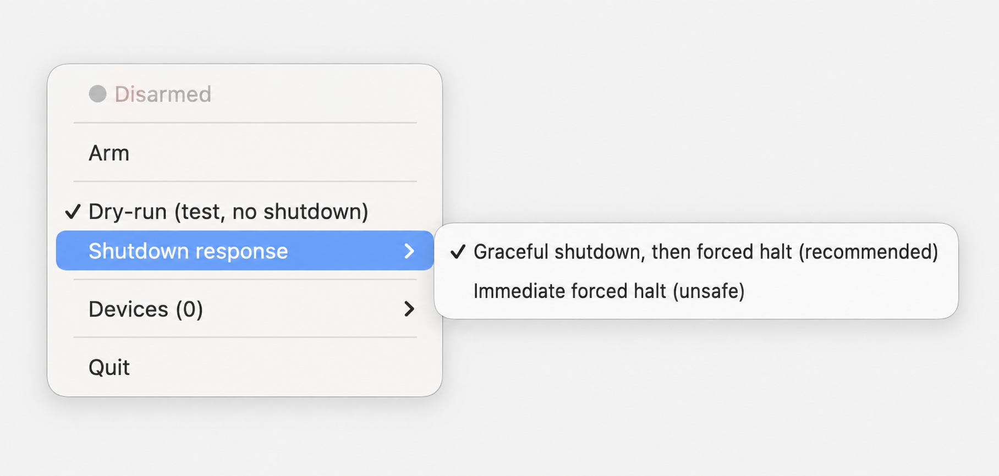

# USB Watchdog

USB Watchdog is a macOS menu-bar tamper alarm. It records the observable USB,
Thunderbolt, SD-card, and external-display inventory, then initiates shutdown if
that inventory changes.

It is intentionally conservative, but it is not device authentication. A
device that reproduces the same descriptor and interface profile can be
indistinguishable, and a change made and reversed while the Mac is asleep can be
missed. Read [SECURITY.md](SECURITY.md) before relying on it.



## Why this exists

USB devices receive powerful access to a computer. A single accessory can act
as a keyboard, network adapter, storage device, or several of these at once.
BadUSB demonstrated how modified device firmware can abuse that trust to inject
commands, redirect traffic, or install malware while still appearing to be an
ordinary accessory.

The same tripwire can detect ordinary peripheral tampering: removing or
substituting a trusted device, adding an unexpected USB or Thunderbolt hub or
dock, or inserting USB or SD storage while the Mac is unattended. In real mode,
it also initiates shutdown if it persistently loses the ability to collect a
complete hardware inventory.

USB Watchdog takes a simple, aggressive approach: it records the expected
peripheral inventory and starts the selected shutdown response when that
inventory changes. It does not inspect firmware or block USB enumeration. It is
a physical-change tripwire designed to limit how long a Mac remains running
after an unexpected peripheral appears.

## Run from source

Python virtual environments contain absolute paths, so recreate `.venv` after
moving or renaming this folder:

```sh
python3 -m venv .venv
.venv/bin/python -m pip install -r requirements.txt
./scripts/build_event_monitor.sh
```

The final command builds the small native IOKit listener used for event-triggered
USB checks. Xcode Command Line Tools provide its compiler. Without the helper,
the engine remains operational with polling and reports the reduced state in the
menu.

Then double-click `USB Watchdog.command` or run:

```sh
.venv/bin/python usb_watchdog_gui.py
```

## Build the app

Install the pinned build dependencies and produce a verified local bundle:

```sh
.venv/bin/python -m pip install -r requirements-build.txt
./scripts/build_app.sh
open "dist/USB Watchdog.app"
```

Dry-run is selected by default. Arm the watchdog, add or remove each kind of
device you care about, and confirm the change is reported without a shutdown.

Real mode requests administrator authorization when it is armed and requires a
separate confirmation in the menu app. A healthy green status means a complete,
stable baseline was established and both probe groups are still succeeding.
Orange means the registered process is stale, faulted, no longer reporting a
current heartbeat, or using polling because the native event listener is
unavailable. PID presence alone is not treated as healthy.

## Behavior

- The native IOKit listener requests a USB inventory check when macOS publishes
  or terminates a USB device or interface service. The listener is a scheduling
  signal only; the shell engine still collects and compares the authoritative
  snapshot.
- A timed USB and Thunderbolt check remains active every 0.25 seconds plus probe
  execution time. This fallback continues if the listener exits, hangs, or
  emits an invalid message. While polling continues, the engine retries the
  listener at a bounded interval and returns to event-triggered checks after a
  successful restart.
- USB fingerprints include location, vendor/product IDs, serial and product
  strings, USB and device revisions, device class, maximum control-packet size,
  configuration count, and a sorted profile of the interfaces macOS publishes.
- SD cards and external displays are checked every 12 fast loops. The cadence is
  12 waits and fast probes plus one slow probe, rather than exactly 3 seconds.
- Every inventory command has a 3-second timeout and bounded retries.
- In real mode, a persistent inventory-probe failure fails closed by initiating
  shutdown. In dry-run mode, it reports a fault and retains the last known-good
  baseline until that probe group recovers.
- After wake, the engine waits briefly for hardware to settle, restarts the
  native listener so IOKit notifications are freshly registered, and compares a
  new stable snapshot with the pre-sleep baseline. A remaining difference
  initiates shutdown. If the listener cannot restart, timed polling continues
  and the menu reports the fallback.
- The recommended shutdown response first requests the normal syncing macOS
  shutdown. If the machine is still running after 5 seconds, the engine
  repeatedly requests a forced quick halt.
- An optional immediate forced-halt response skips the normal shutdown request.
  Both responses can lose unsaved data; the immediate response is riskier.

The menu app starts a detached instance, but there is no automatic restart
service. If the engine exits, the open menu app reports the stale/missing
heartbeat. Quitting the menu app does not stop an armed engine; disarm it first
if monitoring should end.

The menu app controls only the two exact instances it registered. A watchdog
started directly in Terminal without a state file remains independent.

On a Mac laptop with Apple silicon, set **System Settings → Privacy & Security →
Allow accessories to connect** to **Always Ask** for a stronger preventive
layer. macOS then requires approval before an accessory receives data access;
USB Watchdog remains a separate detection-and-response layer. See [Apple's
accessory-security guidance](https://support.apple.com/102282).

## Command-line checks

Print the current validated snapshot without arming:

```sh
./usb_watchdog.sh --snapshot
```

Run without shutdown capability:

```sh
./usb_watchdog.sh --dry-run
```

Run for real in the foreground:

```sh
sudo ./usb_watchdog.sh
```

Select an immediate forced halt instead of the default graceful attempt:

```sh
sudo ./usb_watchdog.sh --shutdown-policy force-immediately
```

## Development

Run the regression suite and static checks:

```sh
.venv/bin/python -m unittest discover -s tests -v
/bin/bash -n usb_watchdog.sh
./scripts/build_event_monitor.sh
shellcheck usb_watchdog.sh scripts/build_app.sh scripts/build_event_monitor.sh
```

`requirements-build.txt` records the complete dependency set used for the
current local app build. `scripts/build_app.sh` removes only the ignored
`build/` and `dist/` outputs, builds the Python app and native event listener,
removes unsupported extended attributes, applies an ad-hoc local signature,
verifies that signature, and checks both bundled executables against the source
build.

The resulting app is for local use. It is not Developer ID signed or notarized
for distribution.

The same checks run on macOS for pushes and pull requests through the repository
workflow. App bundling is also exercised there; the generated CI artifact is not
published as a release.

## Supported environment

The current source, tests, and Apple-silicon app bundle were verified on macOS
26.6.2 with Python 3.14.7 and Apple Clang 17. The project uses IOKit and macOS
system tools including `ioreg`, `system_profiler`, `osascript`, `shutdown`, and
`halt`; it is not intended for Linux or Windows. Other macOS and Python versions
have not yet been verified.

## License

Released under the [MIT License](LICENSE).
